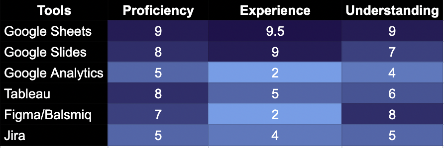

# Hi, I’m Alex Berrhto 

**Chemist by Degree | Data Analyst by Spite | Java Hater by Experience**

I didn’t choose the tech life; I chose to be lazy, and the tech life chose me. My journey into coding started with a goldfish attention span, a 2.7 CGPA (out of 4), and a deep-seated hatred for manual data entry.

Now, I spend my time making sure data flows better than my attempts at Chemistry.

* **Currently working on:** Advanced Python & mastering the art of "Thinking" as a Data Analyst.
* **Main Squeeze:** Python (It’s not Java, so I love it).
* **Off-duty:** 1500 ELO Chess player (Grandmaster status loading...).
* **Fun Fact:** My first project was a Java calculator. I still haven't touched OOP in Java. Don't ask.

> “I automate 8-hour jobs into 2-hour jobs. What I do with the other 6 hours is between my internet provider and me.”

  
<b>📖 Click to read the Legend of Alex Berrhto (it involves failing Chemistry)</b>

   

Born into a lower-middle-class family on the outskirts of Mumbai, I’ve had a life that feels less like a journey and more like a high-stakes roller coaster simulation.

My name is **Alex Berrhto**. And no, I’m not auditioning for *Indian Idol*, so I’ll spare you the sob story. I’m only giving you the context so you can truly appreciate the spectacular series of decisions that led me here.

---

### 🧪 The Chemistry of Failure
I spent my youth busy accumulating an exceptionally healthy amount of childhood memories and a deviously fun college experience. It was only after graduating from **St. Xavier’s College** with a degree in Chemistry that I paused to ask myself, “What next?”

Originally, I wanted to be a doctor. But after failing to crack the NEET, I pivoted to Basic Sciences. My strategy for choosing a major was a stroke of absolute genius: **I copied my best friend’s admission form, word for word.** By my third year, I chose Chemistry—the only subject I had not only failed in my first year but consistently scored the lowest in ever since. I was staring at a dismal **2.7/4.0 CGPA**. After a montage of endless YouTube tutorials, I managed to drag it up to a **3.2**. Better late than never!

---

### ☕ The Java Nemesis
Then came COVID-19. Unlike other guys who downloaded *GTA* on their first PC, I downloaded the **Java IDE**. Why? Pure curiosity from hacker movies. 

 While working an internship as a data entry guy (having learned just enough Excel to be dangerous),I spent my nights wrestling with code. I mastered Google Sheets in two months because it felt like a playground compared to the battlefield of Java. Eventually, I reached the pinnacle of my programming career: **I built a calculator.** In my head, I had conquered Java. I was done with those filthy, long `public static void main` statements. 

I started putting JAVA on my resume. It takes guts to claim expertise with a calculator as your star project. But I convinced my company I was "The One" for data entry. How could I say no to the very first proposal of my life?

---

### 🐍 The Python Romanc e
 During this search—and due to my attention span of a goldfish—I came across a YouTube video: “Learn how to create your own website.” Ooh! La! La! A website! God damn, a website! No joke, even I can learn to make a website! How could I miss this?
 This is how I ended up learning HTML, CSS, PHP, and JavaScript. At least, I tried learning JavaScript. I thought it was no better than Java; I thought they were the same. The name is a scam. I am warning you: these languages starting with "Java" are very bad. But anyway, after creating websites for non-existent hotels, gyms, and restaurants—so many, because I really liked playing with CSS and copying backend JavaScript from Stack Overflow—three months passed before I remembered something. Oh yes! I was supposed to be looking for a tool to make my life easy. See how cool I am? I accidentally learned a full stack just for the love of the game.
During "Search 2.0," a YouTuber whispered through the screen of my laptop, “Alex, come near… You know, there is a language in trend that will help you automate your data entry? Want to know what it is?” I asked what. It whispered: “Python.”
Absolute goosebumps. What a cool name. How can someone not feel like learning Python? Come on! And when I searched, I saw they have Anaconda too! I definitely had to learn this. And guess how traumatizing that bitch Java must have been to me, because learning Python felt like basic math and English. Well, curse you, Java! May you be replaced completely by Python in Android as well. I don’t know if that’s possible, but yes, curse you!
Coming back to Python, I found my love. I started coding day and night. By this time, the only thing I remembered about Java was its spelling. I started learning Python and, you know what? I automated my work! Yippee. Now: less work, more fun, and more Python. At least, that’s what I thought.
But I became so efficient with data entry that they took me out of there and put me in **Data Analysis**.

---

### 📊 The Thinking Problem
Now Python couldn't help me with the most challenging part of the new job: **“Thinking.”** I was a robot copy-pasting data, and now they expected logic? So unfair! But I had to earn, so I learned Statistics from Stanford Online and started playing chess—reaching **1500 ELO**.

Eventually, the "worm" of curiosity bit again. I discovered **SQL**. Believe me, this language is just normal English with brackets and commas. I mastered it in two weeks along with Tableau.

---

### 📍 Where I am Now
I’ve learned a lot about the data lifecycle—collection, storage, transformation, and retrieval.  The path is still **chaotic as fuck**, but I’m blessed with "structured chaos." My curiosity drives me to learn; my economic constraints force me to survive.

So here I am. A guy with a Chemistry degree I don't use, a 1500 ELO in chess I don't need, and a resume full of languages I learned while trying to avoid actual work. I'm a Data Analyst. But we both know the truth: **I'm just a guy who really, really hates Java.**

**To be continued...**

### 🧠 Soft Skills

  

### 💻 Technical Languages

  

### 🛠️ Tools Heatmap

  

